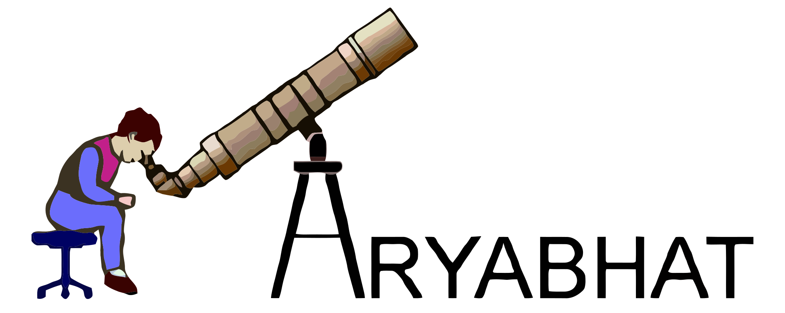

# Aryabhat Design Guidelines

> Source of truth for the look, feel, and behaviour of [newindex.html](newindex.html).
> Use this when building new pages or porting existing ones (Quiz, Sky, Photos, Contact, etc.) so the brand stays cohesive.

This doc is intentionally short. If a rule isn't here, the answer is: read the CSS variables and the components below, and stay consistent.

---

## 1. Foundations

### 1.1 Colour tokens

Defined in `:root` of [newindex.html](newindex.html#L191). Reuse as CSS variables; do not hardcode hex values in components.

| Token | Value | Where it shows up |
|---|---|---|
| `--gold` | `#ffcc33` | Primary brand accent, active states, headlines em |
| `--gold-soft` | `#ffe58a` | Hover text, pull-quote, light gold moments |
| `--gold-deep` | `#ffa41b` | Bottom of primary-button gradient |
| `--ink` | `#e6eef7` | Default body / nav-link text |
| `--ink-dim` | `#9fb3c8` | Captions, footer, muted copy |
| `--accent-cyan` | `#1EAEDB` | Secondary cosmic accent (sparingly) |
| `--panel` | `#16223388` | Translucent card backgrounds |
| `--panel-solid` | `#1a2636` | Opaque panel surface |
| `--border` | `#2a3d55` | Default 1px borders on panels |

Background sky is a fixed gradient painted by [js/cosmos-bg.js](js/cosmos-bg.js); do not put solid backgrounds on the `<body>` or full-bleed sections — let the starfield show through.

### 1.2 Typography tokens

```css
--font-brand:   'renfrewregular', 'Space Grotesk', Arial, sans-serif;
--font-display: 'Space Grotesk', 'Outfit', system-ui, sans-serif;
--font-body:    'Outfit', system-ui, -apple-system, BlinkMacSystemFont, 'Segoe UI', sans-serif;
```

| Font | When to use |
|---|---|
| **`--font-brand`** (renfrew) | Big display moments only: mega taglines, section H2s, large numbers, drop-caps, pull-quotes. The Aryabhat heritage face. **Never use for italics** — there's no italic file in `@font-face` ([css/style.css:1-8](css/style.css#L1)) and browsers will synthesise ugly slants. **Never use for body copy** — it's a display face and will tank readability at 1rem. |
| **`--font-display`** (Space Grotesk) | UI: navbar links, buttons, kickers, small section H3/H4s, the marquee, do-tile numbers. Anything functional or under ~1.4rem. |
| **`--font-body`** (Outfit) | Paragraphs, ledes, captions, anywhere prose lives. Outfit is the closest free Google-Sans-like face on Google Fonts — friendly, geometric, slightly rounder than Space Grotesk so the two read as different families. |

Renfrew has more vertical air than Space Grotesk — when you switch a heading to `--font-brand`, **bump line-height by ~0.05** (e.g. `1.1` → `1.15`) and **drop negative letter-spacing**, otherwise the strokes mash.

### 1.3 The brand shape

```css
--brand-shape:       14px 4px 14px 4px;
--brand-shape-tight: 10px 3px 10px 3px;
```

Asymmetric corners on the TL→BR diagonal — softly evokes a comet trajectory.

**Use on:** buttons, the navbar's *active* pill.
**Do not use on:** cards, panels, containers, inactive navbar links, images. Containers stay on a regular `border-radius: 14–22px`. The brand shape is reserved for click affordances so its appearance carries meaning — "this is an action".

Use `--brand-shape-tight` for elements smaller than ~36px tall (otherwise the 14px curve dominates).

### 1.4 Radii (containers)

| Use | Radius |
|---|---|
| Small content cards (`.update-card`, `.do-tile`) | `14–16px` |
| Section panels (`.story-wrap`, `.join-banner`) | `18–22px` |
| Pills / micro-tags | `999px` (full pill) |

### 1.5 Spacing rhythm

Sections breathe more than they crowd. Rough scale:

| Spot | Desktop | Mobile (≤600px) |
|---|---|---|
| Section bottom margin | `2.0–3.0rem` | `1.2–1.8rem` |
| Card inner padding | `22px 18px` | `18px 16px` |
| Hero vertical padding | `3rem 1rem 2.5rem` | `1.8rem .5rem 1.6rem` |

Use `clamp()` instead of media-query font sizes wherever possible — see how [`.section-label h2`](newindex.html#L566) scales fluidly between breakpoints.

---

## 2. Components

Each component below is paired with its canonical markup. Copy these structures verbatim when adding the same pattern elsewhere.

### 2.1 Section + section-label

The recurring structural unit. Every section starts with a kicker + headline pair.

```html
<section class="some-section">
  <div class="section-label">
    <span class="kicker">Eyebrow text</span>
    <h2>Headline with <em>accent</em></h2>
  </div>
  <!-- content -->
</section>
```

- `.kicker` is small (~0.75rem), wide-tracked (`.4em`), uppercase, gold. **It's the only place we use `text-transform: uppercase`** outside the `--font-display` UI.
- `<em>` inside `h2` flips colour to gold (no italic) — that's the brand accent on a single word per headline. Pick one word.

### 2.2 Buttons

```html
<a class="button button-primary" href="...">Primary action</a>
<a class="button" href="...">Ghost action</a>
```

- **Primary**: warm gold gradient `linear-gradient(135deg, #ffd655 0%, #ffa41b 100%)`, near-black text `#0a131c`, 600 weight.
- **Ghost** (default): transparent fill, gold border `rgba(255,204,51,0.5)`, gold text.
- Both use `--brand-shape` and `height: 44px` (40px on mobile).
- Hover: 1px lift + warm gold glow (24px on ghost, 30px on primary).
- Active: settles back, tightens shadow. Uses `margin-bottom: 1rem` to neutralise the base CSS's "prevent layout shift" hack.

Use a primary + 1–2 ghosts in any CTA row (`.cta-row` is `display: flex; gap: 12px; flex-wrap: wrap; justify-content: center`).

### 2.3 Cards

#### Update card (non-collapsible header strip)

```html
<div class="update-card">
  <div class="update-card-head"><h4>Card title</h4></div>
  <div class="card-content" style="text-align:center;">
    <a class="button button-primary" href="...">Action</a>
  </div>
</div>
```

We deliberately do **not** use the `<details>`/`<summary>` collapsible pattern from [css/style.css](css/style.css#L38-L87) on this page; on the home page everything stays open.

#### Do-tile (numbered feature tile)

```html
<div class="do-tile">
  <span class="num">01</span>
  <h3>Title</h3>
  <p>Short description, one or two sentences.</p>
</div>
```

The `01/02/03` watermark sits absolute-positioned top-right at very low alpha gold — it's a decoration, not a UI element.

### 2.4 Hero

```html
<section class="hero">
  <div class="logo-stage">
    
  </div>
  <h1 class="hero-tag">
    <span class="line line-1">Look up.</span>
    <span class="line line-2">Wonder <em>more</em>.</span>
    <span class="line line-3">Fear less.</span>
  </h1>
  <p class="hero-lede">…</p>
  <div class="cta-row">…</div>
</section>
```

- Three-line stacked tagline. Line 2 is the loudest: gold, double the size, brand font, the only line with an `<em>` accent.
- Logo carries a layered white drop-shadow stack (4px tight halo + 12px wash + dark offset). Reuse this filter for any hero-scale brand mark.
- Other pages should adapt the hero to their context — not every page needs the giant 3-line tagline. A single-line hero with a kicker + H1 is the lighter alternative.

### 2.5 Marquee (transitional bar)

```html
<div class="marquee" aria-hidden="true">
  <div class="marquee-track">
    <span>Astronomy</span><span>Wonder</span>...
    <!-- duplicate the list once for seamless loop -->
  </div>
</div>
```

Use sparingly — once per page, between hero and the first content section. Always `aria-hidden="true"` (decorative).

### 2.6 Navbar

The navbar markup is generated by [js/layout.js](js/layout.js) and shared site-wide. This page restyles it via scoped CSS (glass-morph background, gold underline, pill links). When porting:

- The active link gets `.active` and lives inside an `<li class="navbar-item current">`.
- Active pill uses `--brand-shape-tight`.
- On viewports `≤700px` the navbar gains a right-edge `mask-image` fade to hint at horizontal scroll.

### 2.7 Pull-quote / drop-cap (long-form prose)

Inside `.story-wrap`:

```html
<p class="story-first">First paragraph...</p>
<p class="pull-quote">"Highlighted line drawn from the prose."</p>
```

- `.story-first::first-letter` gets a 5rem renfrew gold drop-cap (3.2rem on mobile, otherwise the floated cap creates a narrow column).
- `.pull-quote` is renfrew, gold-soft, with a 3px left gold border. Use it once, max twice, per long article.
- Story paragraphs are `text-align: justify` on desktop, `text-align: left` on mobile (justified text on narrow columns creates visible river-of-whitespace).

### 2.8 Join banner / large CTA

```html
<section class="join-banner">
  <h2>Headline with <em>accent</em>.</h2>
  <p>One sentence of context.</p>
  <div class="cta-row">
    <a class="button button-primary" href="...">Primary</a>
    <a class="button" href="...">Secondary</a>
  </div>
</section>
```

Used once per page, near the bottom or after a key informational block. Has decorative ✦ corners and layered radial glows.

---

## 3. Motion

| Rule | Why |
|---|---|
| Cap canvas animations at **30fps** | Halves CPU on low-end mobiles. See [js/cosmos-bg.js](js/cosmos-bg.js). |
| Cap `devicePixelRatio` at **1.5** in canvas backgrounds | Avoids 9× overdraw on 3× iPhones. |
| **Always honour `prefers-reduced-motion: reduce`** | Disable the animation path entirely or fall back to a static gradient. |
| No `O(n²)` per-pair loops in the background | The legacy [js/background-stars.js](js/background-stars.js) does this; the new [js/cosmos-bg.js](js/cosmos-bg.js) doesn't. New work follows the new pattern. |
| Page-load entrance: `fadeUp .8s ease-out both` with stagger | Subtle, single-trigger. Don't add scroll-triggered animations — they fight the calm sky aesthetic. |
| Logo idle motion: `logo-float 6s ease-in-out infinite` (±6px translate) | Gentle, never large enough to distract. |

Animations the user actively earns (hover, click) get tighter timing (`.15–.25s ease`).

---

## 4. Voice

- **Kickers** are 1–3 words, sentence-cased ideas: *"What we do"*, *"What's happening"*, *"About the Foundation"*.
- **Headlines** are 3–6 words with one italic-accent word: *"Science, **made tasty***", *"The **mother** of all sciences, served warm*", *"Bring the **sky** to your school or city*".
- **Body copy** is plainspoken, warm, free of jargon. No exclamation marks, no marketing voice. Read everything aloud once before shipping.
- **Audience assumption**: a smart layperson with no astronomy background. If a sentence needs domain knowledge, rewrite it.

---

## 5. Performance & accessibility budget

- The page must remain usable on a 4-year-old Android phone with 3G connectivity. That's the test device.
- `html, body { overflow-x: hidden; }` is non-negotiable on this page — the legacy navbar layout otherwise causes horizontal page scroll on mobile (see floated `.navbar-item` in [css/style.css:892](css/style.css#L892)).
- All decorative images should have `alt=""` and decorative containers should have `aria-hidden="true"`.
- Headings must descend in order (`<h1>` → `<h2>` → `<h3>`). The page has exactly one `<h1>` (the hero tagline).
- Web fonts ship with `&display=swap` so text renders in the fallback while the WOFF2 loads.
- Canvas backgrounds use `pointer-events: none` and `z-index: -1` so they never intercept clicks or appear above content.

---

## 6. Porting checklist (when adapting this system to another page)

When you touch [quiz.html](quiz.html), [sky.html](sky.html), [photos.html](photos.html), [contact.html](contact.html), or any new page:

1. **Add the Google Fonts link** for Space Grotesk + Outfit (renfrew is already in [css/style.css](css/style.css)).
2. **Copy the `:root` token block** (colours + font tokens + brand shapes) to a scoped `<style>` in the page head, OR migrate it to [css/style.css](css/style.css) once we're ready to commit globally.
3. **Swap [js/background-stars.js](js/background-stars.js) → [js/cosmos-bg.js](js/cosmos-bg.js)** for that page. The old script's per-pair distance loop is the slowest thing on the site.
4. **Hide the layout.js header** (`.container > .header { display: none !important }`) only if the page has its own hero; otherwise let the wordmark + logo render normally.
5. **Override the navbar styling** (the entire navbar block from this page is portable as-is).
6. **Override buttons** (the entire button block is portable as-is — the universal `.main .button` selectors handle it).
7. **Pick components from §2** as needed; don't introduce one-off card or button styles. If a new pattern is needed, add it here first.
8. **Run a Lighthouse mobile pass** before merging. Performance must stay ≥85.

If a design choice fights this guide, the guide is wrong. Update this file in the same PR as the design change so the next person inherits the new rule.
